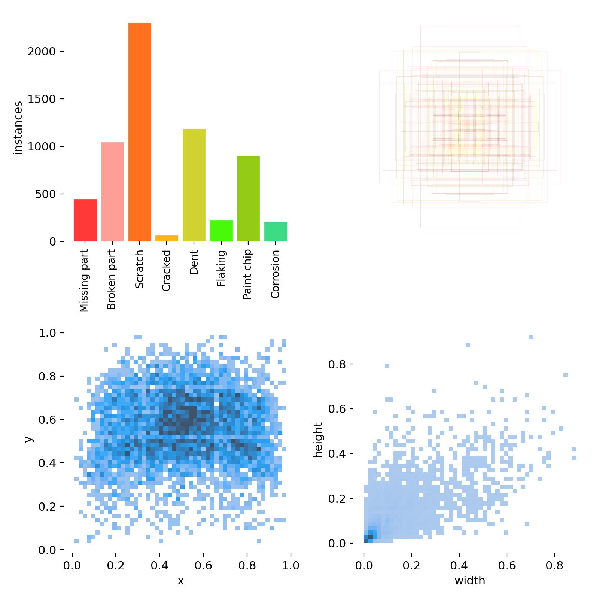
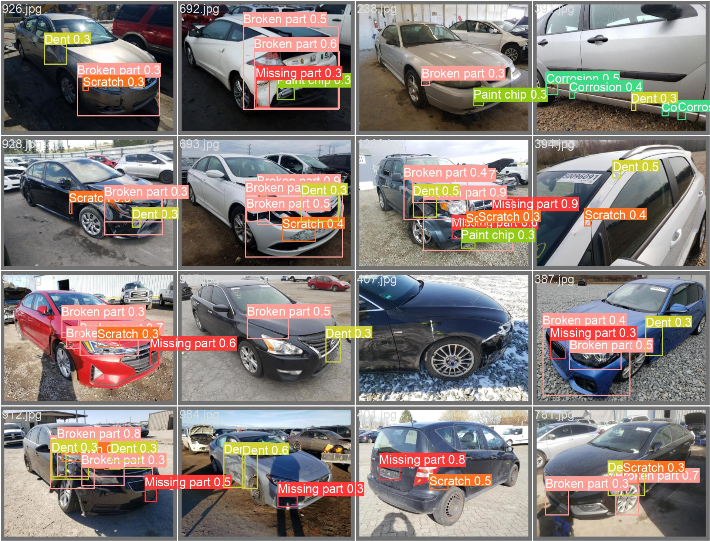

# Damages-detection-with-yolov9

This project is based on the yolov9 [github](https://github.com/WongKinYiu/yolov9)

## Module
The architecture of this work is as follows:

 * [data](/data) : englobes a class of data generator from a predefined folder of images and annotations ([Car parts and damages dataset](https://humansintheloop.org/resources/datasets/car-parts-and-car-damages-dataset/)) and then formatted wrt yolov7 input format. 
    * [_base.py](/data/_base.py)
    * [damages.yaml](/data/damages.yaml)

 * [models](/models) : contains the yolov9 configs.

 * [runs](/runs) : some experiments.
    * [__init__.py](/fmgcam/__init__.py)
    * [_base.py](/fmgcam/_base.py)

 * [utils](/utils) : contains the different components of yolov9.

 * [detect_dual.py](/detect_dual.py)

 * [README.md](/README.md)
  
 * [train_dual.py](/train_dual.py)

 * [val_dual.py](/val_dual.py)

## Training configuration

 Although, the model is trained on a small dataset (569 train images, 163 validation images and 82 test images) it shows satisfiying detection results especially for small damages with imbalanced data. 

 The damages categories are :
   - Missing part
   - Broken part
   - Scratch
   - Cracked
   - Dent
   - Flaking
   - Paint chip
   - Corrosion

Their annotation distribution are quite imbalanced :

## Experimentation and observation
It's crystal clear that the model behave quite bad on some rare classes. Nevertheless, further improvments will be taken into account to enhance the learning on theses underweighted classes. 

